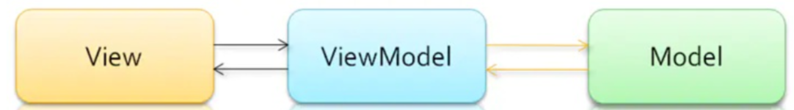
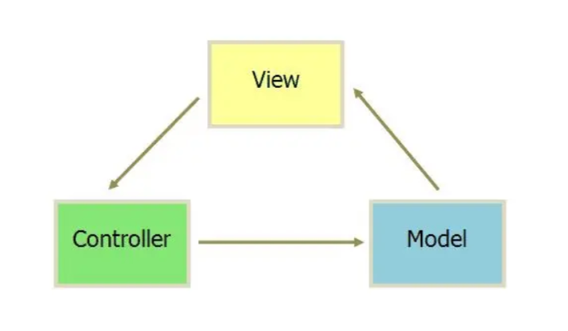

# 介绍一下 MVVM 模式，和 MVC 模式有什么区别？

MVVM 即 Model-View-ViewModel 的简写，即模型-视图-视图模型。模型（Model）指的是后端传递的数据。视图（View）指的是所看到的页面。视图模型（ViewModel）是 MVVM 模式的核心，它是连接 View 和 Model 的桥梁。

视图模型有两个方向的作用：

- 将视图（View）与模型（Model）进行双向绑定，当数据发生变化时，视图会自动更新。
- 将视图（View）转化成模型（Model），即将所看到的页面转化成后端的数据，实现的方式是：DOM 事件监听。

当这两个方向的数据转换都实现时，我们称之为数据的双向绑定。

MVVM 模型图解：

MVC 是 Model-View-Controller 的简写，即模型-视图-控制器。M 和 V 指的意思和 MVVM 中的 M 和 V 意思一样。C 即 Controller 指的是页面业务逻辑。使用 MVC 的目的就是将 M 和 V 的代码分离。MVC 是单向通信，也就是 View 跟 Model ，必须通过 Controller 来承上启下。

MVC 模型图解：

MVVM 与 MVC 最大的区别就是：MVVM 实现了 View 和 Model 的自动同步，也就是当 Model 的属性改变时，我们不用再自己手动操作 Dom 元素来改变 View 的显示，而是改变属性后该属性对应 View 层显示会自动改变（双向绑定）。
